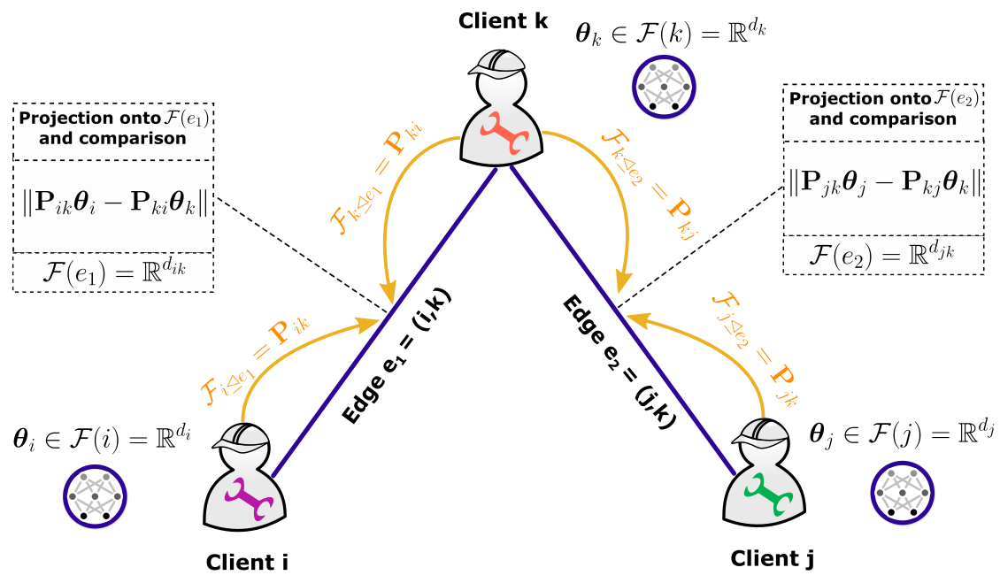

# Tackling Feature and Sample Heterogeneity in Decentralized Multi-Task Learning: A Sheaf-Theoretic Approach

This repository is the official implementation of [Tackling Feature and Sample Heterogeneity in Decentralized Multi-Task Learning: A Sheaf-Theoretic Approach](https://openreview.net/forum?id=JlPq0LmApB).



## Summarized Abstract

We introduce a novel sheaf-theoretic approach for federated multi-task learning (FMTL) that addresses challenges arising from feature and sample heterogeneity across clients. By representing client relationships using cellular sheaves, our framework flexibly models interactions between heterogeneous client models. Our algorithm, Sheaf-FMTL, achieves substantial communication savings while maintaining competitive performance compared to state-of-the-art decentralized FMTL baselines.

## Requirements

To install requirements:

```bash
pip install -r requirements.txt
```

## Datasets

The experiments use six datasets:

- **Rotated MNIST (R-MNIST):** MNIST with different rotation angles across clients
- **Heterogeneous CIFAR-10 (H-CIFAR-10):** CIFAR-10 with heterogeneous label distribution
- **Human Activity Recognition (HAR):** Sensor data from 30 individuals
- **Vehicle Sensor:** Acoustic and seismic data from 23 sensors
- **GLEAM:** Google Glass sensor data from 38 individuals
- **School:** Exam results prediction for 139 schools
 
R-MNIST and H-CIFAR-10 datasets will be automatically downloaded when running experiments. The rest of the datasets can be found in [here](https://www.dropbox.com/scl/fi/lmowok6urm9tgxa7fy00r/private_silos_data.zip?dl=0&e=1&file_subpath=%2Fprivate_silos_data&rlkey=a92z4c5d461t4fy1uei4p9tsb)[^1]. Put datasets in the following structure: `data/<dataset_name>/<content>`, e.g. `data/vehicle.mat`.

## Training

To train Sheaf-FMTL on a specific dataset:

```bash
# Rotated MNIST
python experiments/run_rotated_mnist.py --lambda_reg 0.001 --alpha 0.005 --eta 0.0001 --gamma 0.01 --num_rounds 200 --save_results

# Heterogeneous CIFAR-10
python experiments/run_heterogeneous_cifar10.py --lambda_reg 0.001 --alpha 0.005 --eta 0.01 --gamma 0.01 --num_rounds 150 --save_results
```

## Key Parameters

- `--lambda_reg`: Regularization parameter controlling task relationship strength
- `--alpha`: Learning rate for model parameters
- `--eta`: Learning rate for restriction maps
- `--gamma`: Controls the dimension of the interaction space ($d_{ij} = ⌊\gamma d⌋$)
- `--num_rounds`: Number of communication rounds

## Visualization

The `utils/visualization.py` module provides comprehensive plotting utilities for analyzing experimental results. Here's how to use them:

```python
from utils.visualization import (
    plot_training_curves, plot_comparison, plot_communication_accuracy_tradeoff,
    plot_client_distribution, plot_restriction_maps_analysis, 
    save_results_to_json, load_results_from_json
)

# Load saved results
results = load_results_from_json('results/sheaf_fmtl_rmnist_gamma0.01.json')

# Plot training curves for a single experiment
plot_training_curves(
    results['history'], 
    title="Sheaf-FMTL on Rotated MNIST",
    save_path="figures/rmnist_training_curves.png"
)
```

## Citation

If you use this code in your research, please cite:


```bash
@article{benissaid2025sheaffmtl,
  title={Tackling Feature and Sample Heterogeneity in Decentralized Multi-Task Learning: A Sheaf-Theoretic Approach},
  author={Ben Issaid, Chaouki and Vepakomma, Praneeth and Bennis, Mehdi},
  journal={Transactions on Machine Learning Research},
  year={2025}
}
```

[^1]: The datasets are provided by the following paper: Liu, Ken, et al. "On privacy and personalization in cross-silo federated learning." Advances in neural information processing systems 35 (2022): 5925-5940.
